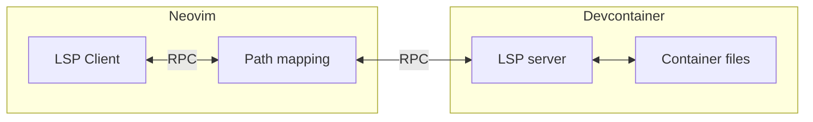

# 📦 devcontainers.nvim

Neovim plugin that allows to seamlessly run LSP servers in [devcontainers](https://containers.dev).

## ✨ Features

- [x] Run LSP server in devcontainer while Neovim is running on host system
- [x] Translate paths within LSP `root_dir` between container paths and host system paths
- [x] Translate paths outside of `root_dir` allowing for seamless `textDocument/definition` to system files inside container
- [x] Automatically start devcontainer if `.devcontainer/` exists in `root_dir`
- [x] Delay LSP server start until devcontainer is ready
- [x] Compatible with new `vim.lsp.config` API
- [x] Compatible with the legacy [nvim-lspconfig](https://github.com/neovim/nvim-lspconfig) `on_new_config` API

## 📝 Design

There are multiple approaches to using devcontainers with text editor.

VSCode acts by installing and starting a headless instance of itself inside the container and then connecting
a frontend to it from the host system. This approach limits usability of the editor for things not related to
the container and requires modifying the container to install the server.
Similar apprach is taken by [esensar/nvim-dev-container](https://github.com/esensar/nvim-dev-container) and
[arnaupv/nvim-devcontainer-cli](https://github.com/arnaupv/nvim-devcontainer-cli).

This plugin takes an alternative approach. Neovim runs on host system, so you have your full configuration and
access to the whole system. However, when starting an LSP server, instead of running it on host system, it runs inside
the devcontainer itself (using `devcontainer exec ...`). Then devcontainers.nvim intercepts the whole RPC communication
between LSP client (nvim) and server. All URIs in RPC messages are translated based on devcontainer workspaceFolder
such that both the client and the server see correct paths for their corresponding environments.
Below is a simplified diagram:



Efficient identification of URIs in LSP messages is possible by utilizing the [metaModel.json](https://microsoft.github.io/language-server-protocol/specifications/lsp/3.17/specification/#metaModel)
provided in LSP specification. devcontainers.nvim parses this file and creates a lookup of URI positions by message
type, so there is no need to recursively iterate over all data and match uris by regex.

## ⚙️ Configuration

Install dependencies:

* Neovim nightly (not tested on stable but might work)
* [devcontainers-cli](https://github.com/devcontainers/cli)

Configure the plugin using plugin manager of choice, e.g. lazy.nvim

```lua
{
    'jedrzejboczar/devcontainers.nvim',
    dependencies = {
        'netman.nvim', -- optional to browse files in docker container
    },
    opts = {},
}
```

For full configuration options see [devcontainers/config.lua](lua/devcontainers/config.lua).

**Optional dependencies:**

* [nvim-lspconfig](https://github.com/neovim/nvim-lspconfig) - not strictly needed, but will make the configuration much easier; currently there are no official instructions for configuration without nvim-lspconfig
* [netman.nvim](https://github.com/miversen33/netman.nvim) (or some other plugin) - needed in order to open files from the container (files not mounted on host system); the plugin must provide BufReadCmd for buffers with `docker://` scheme

## 🚀 Getting started (`vim.lsp.config`)

### Built-in `vim.lsp.config`

To use devcontainers.nvim with the new built-in Neovim `vim.lsp.config` API you just need to change the `cmd`
in configuration table, e.g.

```lua
vim.lsp.config('clangd', { cmd = require('devcontainers').lsp_cmd({ 'clangd' }) })
```

Or if you already have some config defined in `lsp/*.lua` file under `runtimepath` (these files are now e.g.
provided by nvim-lspconfig), you can wrap `cmd` defined there, e.g.

```lua
vim.lsp.config('clangd', { cmd = require('devcontainers').lsp_cmd(vim.lsp.config.clangd.cmd) })
```

You can also define different `cmd` to use on per-directory basis using
`require('devcontainers.local_cmd').set(root_dir, client_name, cmd)`.
This can also be put in `.nvim.lua` instead your main Neovim config
(see ['exrc'](https://neovim.io/doc/user/options.html#'exrc')).

For example, suppose that you have some default `cmd = { 'clangd' }` already defined, but if you start LSP
root_dir matches `/some/dir` then you want to have different command:

```lua
vim.lsp.config('clangd', { cmd = require('devcontainers').lsp_cmd { 'clangd' } })
require('devcontainers.local_cmd').set('/some/dir', 'clangd', { 'clangd', '--query-driver=/usr/bin/arm-none-eabi-*' })
```

This can be combined with ['exrc'](https://neovim.io/doc/user/options.html#'exrc'). Ensure that 'exrc' is enabled
(`set exrc`), then `/some/dir/.nvim.lua`:

```lua
local dir = '/some/dir' -- or by parsing `debug.getinfo(1, 'S').source`
require('devcontainers.local_cmd').set(dir, 'clangd', { 'clangd', '--query-driver=/usr/bin/arm-none-eabi-*' })
```

### nvim-lspconfig + on_new_config

> This is still supported but considered legacy API. `on_new_config` is deprecated in nvim-lspconfig
> so users are advised to use the new built-in `vim.lsp.config` API.

The simplest setup is to enable devcontainers.nvim for all LSP clients:

```lua
local lspconfig_util = require('lspconfig.util')
lspconfig_util.on_setup = lspconfig_util.add_hook_after(lspconfig_util.on_setup, function(config, user_config)
    config.on_new_config = lspconfig_util.add_hook_after(config.on_new_config, require('devcontainers').on_new_config)
end)
```
This will add `devcontainers.on_new_config` hook to all LSP configurations.
The hook checks if `.devcontainers` directory exists in `root_dir`. If it does then the devcontainer is
started and then the server is spawned inside the container.
The `devcontainers.on_new_config` hook should generally be the last hook added (use `lspconfig_util.add_hook_after`)
because it modifies `config.cmd` replacing it with functions that do the path mapping between host/container,
so modifying `config.cmd` after this is not possible.

Alternatively you can perform the setup only for selected LSP clients, e.g.

```lua
require('lspconfig').clangd.setup {
    cmd = { 'clangd', '--background-index', '--clang-tidy' },
    on_new_config = require('devcontainers').on_new_config,
}
```

### Usage

If the setup is correct, this plugin does not require anything more - the LSP should *just work*.
When you open a file for which LSP has been configured, the devcontainer will be started and then
LSP client will connect and use the LSP server inside the container.

Some additional commands are available:

* `DevcontainersUp` - start devcontainer
* `DevcontainersExec cmd...` - execute a command inside devcontainer and print the result
